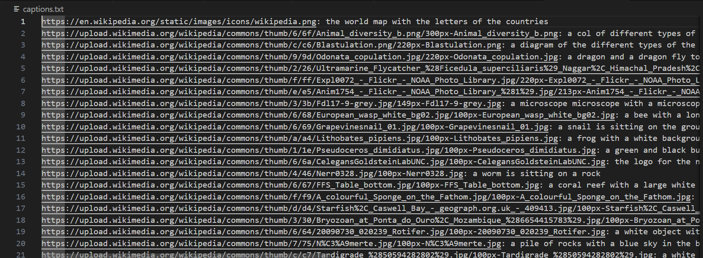

# Image Captioner

A Python tool that scrapes images from web pages and generates natural language captions using the BLIP image captioning model.

## Features

- Web scraping of images using BeautifulSoup
- Image downloading with retry mechanism
- Automatic caption generation using BLIP model
- Handles various image formats and URLs
- Generates a text file with image URLs and their captions

## Technologies Used

- **Python**: Core programming language
- **BeautifulSoup4**: HTML parsing and web scraping
- **Transformers**: Hugging Face library for NLP models
- **BLIP**: Bootstrapping Language-Image Pre-training model
- **PyTorch**: Deep learning framework
- **Pillow**: Image processing library
- **Requests**: HTTP library for API calls

## Prerequisites

- Python 3.8+
- Required Python packages:
```bash
pip install requests
pip install Pillow
pip install beautifulsoup4
pip install transformers
pip install torch
```

## Installation

1. Clone the repository:
```bash
git clone https://github.com/hassan2-aamir/image_captioner.git
cd image_captioner
```

2. Install dependencies:
```bash
pip install -r requirements.txt
```

## Usage

1. Run the script:
```bash
python src/image_captioner.py
```

The script will:
- Scrape images from the Wikipedia "Animal" page
- Process each valid image
- Generate captions using the BLIP model
- Save results to `captions.txt`

## Configuration

The script uses the following models and settings:
- Model: `Salesforce/blip-image-captioning-base`
- Max retries for image download: 3
- Minimum image size: 400 pixels (width * height)

## Output

The script generates a `captions.txt` file containing:
```
image_url: generated caption
```

## Error Handling

- Retries failed image downloads
- Skips SVG images and small icons
- Handles malformed URLs
- Converts RGBA/P images to RGB

## Demo

The program generates a file like this in the end with format image_url: generated caption


